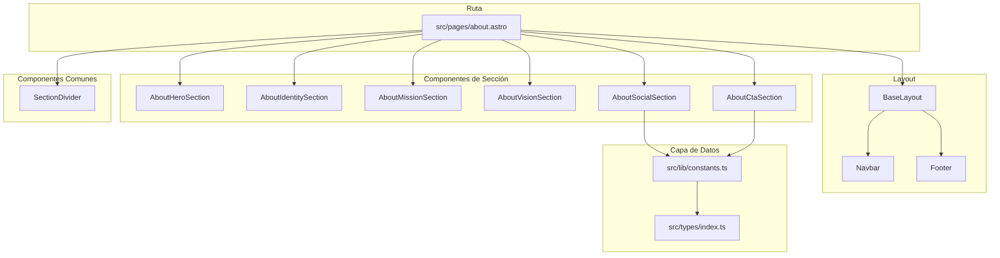

# Documento de Diseño — About Page

## Resumen

La página About (`/about`) presenta la identidad, misión, visión, canales sociales y CTA del AWS Student Builder Group Universidad del Valle. Esta iteración enriquece la calidad visual de la página para igualar el nivel del Home, incorporando:

- Radial gradients y dot grid patterns de fondo
- Más elementos geométricos flotantes
- SVG decorativo de arquitectura cloud en el Hero
- Badges temáticos en la sección de identidad
- Iconografía y border-left gradiente en Misión/Visión
- Tarjetas prominentes para redes sociales con glow hover
- CTA como cierre visual con composición envolvente
- Separadores visuales entre secciones

**Decisiones clave:**
- NO se modifica contenido textual, enlaces, accesibilidad ni rendimiento.
- NO se introduce JavaScript client-side adicional.
- Todos los enriquecimientos son CSS/SVG inline que se renderizan en build time.
- Se reutiliza el 100% de los tokens y patrones del Design System existente.

## Arquitectura



### Flujo de Renderizado

1. Astro construye `src/pages/about.astro` en build time.
2. `about.astro` importa BaseLayout y los 6 componentes de sección + SectionDivider.
3. Las secciones se renderizan con separadores entre ellas.
4. Cada sección usa `data-animate` — el IntersectionObserver existente en BaseLayout maneja las animaciones.
5. El Hero usa clases `hero-animate` para animación de carga inicial.
6. Output: HTML estático en `/about/index.html` con cero JS para contenido.

## Componentes

### Nuevo: `SectionDivider.astro`

**Ubicación:** `src/components/common/SectionDivider.astro`

**Propósito:** Separador visual reutilizable entre secciones.

```typescript
interface Props {
  class?: string;
}
```

**Implementación:**
- `<div aria-hidden="true">` con un `<div>` interno que tiene:
  - `height: 1px`
  - `background: linear-gradient(90deg, transparent, var(--sbg-accent-border), transparent)`
  - `max-width: 55%`
  - `margin: 0 auto`
- Contenedor con `py-4` para spacing vertical
- Decoración opcional: un pequeño rombo o círculo centrado sobre la línea

### Modificado: `AboutHeroSection.astro`

**Cambios respecto a implementación actual:**

1. **Radial gradients de fondo** (igual que Home):
   ```html
   <!-- Gradient naranja superior izquierda -->
   <div aria-hidden="true" class="pointer-events-none absolute inset-x-0 top-0 h-[60vh]"
     style="background:radial-gradient(ellipse 55% 45% at 30% 0%,rgba(255,153,0,0.08) 0%,transparent 65%);">
   </div>
   <!-- Gradient azul inferior derecha -->
   <div aria-hidden="true" class="pointer-events-none absolute bottom-0 right-0 h-[50vh] w-[50vw]"
     style="background:radial-gradient(ellipse at 80% 100%,rgba(35,47,62,0.35) 0%,transparent 60%);">
   </div>
   ```

2. **Dot grid pattern**:
   ```html
   <div aria-hidden="true" class="pointer-events-none absolute inset-0 opacity-[0.025]"
     style="background-image:radial-gradient(circle,#fff 1px,transparent 1px);background-size:36px 36px;">
   </div>
   ```

3. **Más floating shapes** (4+ en total): triángulo, círculo, cuadrado, rombo — distribuidas en las esquinas con diferentes delays y duraciones.

4. **SVG decorativo cloud** (solo desktop ≥1024px):
   - Grupo de nodos conectados por líneas (estilo de red cloud/arquitectura)
   - Opacity 0.08–0.12
   - Posicionado a la derecha del contenido de texto
   - Layout con grid: texto a la izquierda, SVG a la derecha en lg+

5. **Mayor padding vertical**: `py-20 lg:py-28` para dar presencia similar al Home.

### Modificado: `AboutIdentitySection.astro`

**Cambios:**

1. **Badges decorativos** debajo del párrafo:
   ```html
   <div class="mt-6 flex flex-wrap gap-2">
     {badges.map(badge => (
       <span class="inline-flex items-center gap-1.5 rounded-full border border-[var(--sbg-border)]
         bg-[var(--sbg-accent-subtle)] px-3 py-1 text-[0.72rem] text-[var(--sbg-text-muted)]"
         style="font-family:'Space Mono',monospace;">
         {badge}
       </span>
     ))}
   </div>
   ```
   Badges: "AWS", "Cloud", "Workshops", "Certificaciones", "Comunidad", "Networking", "Leadership"

2. **Floating shape** adicional con `float-rhombus` animation.

3. **Radial gradient sutil** en esquina inferior derecha del card.

### Modificado: `AboutMissionSection.astro`

**Cambios:**

1. **Icono SVG decorativo** (target/compass) en la esquina superior derecha del card:
   - 40×40px, color `--sbg-accent` con opacity 0.15
   - `aria-hidden="true"`
   - Posicionamiento absoluto dentro del card

2. **Border-left gradiente**:
   ```css
   /* Pseudo-elemento o div wrapper */
   border-left: 3px solid transparent;
   border-image: linear-gradient(to bottom, var(--sbg-accent), transparent) 1;
   ```
   Alternativa: usar un `<div>` de 3px con gradient background posicionado absolute a la izquierda.

3. **Radial gradient fondo sutil** en esquina superior izquierda del card:
   ```css
   background: radial-gradient(ellipse at 0% 0%, rgba(139,92,246,0.06), transparent 70%);
   ```

4. **Posicionamiento relativo** en el card para contener los elementos absolutos.

### Modificado: `AboutVisionSection.astro`

**Cambios (misma estructura que Misión pero diferenciada):**

1. **Icono SVG decorativo** (rocket/stars) en esquina superior derecha:
   - Color `--sbg-orange` con opacity 0.15

2. **Border-left gradiente** con color diferente:
   ```css
   border-image: linear-gradient(to bottom, var(--sbg-orange), transparent) 1;
   ```

3. **Radial gradient fondo** en esquina inferior derecha (diferente a Misión):
   ```css
   background: radial-gradient(ellipse at 100% 100%, rgba(255,153,0,0.05), transparent 70%);
   ```

### Modificado: `AboutSocialSection.astro`

**Cambios:**

1. **Tarjetas más grandes** en lugar de iconos pill:
   ```html
   <a class="flex flex-col items-center gap-2 rounded-xl border border-[var(--sbg-border)]
     bg-[var(--sbg-bg-elevated)] p-5 min-w-[100px] min-h-[100px] transition-all duration-200
     hover:scale-105 hover:shadow-lg hover:border-[var(--sbg-accent-border)]
     focus-visible:ring-2 focus-visible:ring-[var(--sbg-accent)]">
     <span class="[&>svg]:w-7 [&>svg]:h-7">{icon}</span>
     <span class="text-xs font-medium text-[var(--sbg-text-muted)]"
       style="font-family:'Space Mono',monospace;">{platform}</span>
   </a>
   ```

2. **Glow hover** por plataforma:
   - LinkedIn: `box-shadow: 0 0 20px rgba(10,102,194,0.15)`
   - WhatsApp: `box-shadow: 0 0 20px rgba(37,211,102,0.15)`
   - Instagram: `box-shadow: 0 0 20px rgba(228,64,95,0.15)`
   - YouTube: `box-shadow: 0 0 20px rgba(255,0,0,0.12)`
   - Email: `box-shadow: 0 0 20px rgba(139,92,246,0.15)`

3. **Grid layout responsive**: `grid grid-cols-2 sm:grid-cols-3 lg:grid-cols-5 gap-4`

4. **Dot grid background** sutil en la sección.

5. **Nombre visible** de cada plataforma debajo del icono.

### Modificado: `AboutCtaSection.astro`

**Cambios:**

1. **Radial gradient de fondo prominente**:
   ```html
   <div aria-hidden="true" class="pointer-events-none absolute inset-0"
     style="background:radial-gradient(ellipse at 50% 30%,rgba(139,92,246,0.08) 0%,transparent 60%);">
   </div>
   ```

2. **Dot grid pattern** de fondo (misma técnica del Home).

3. **Floating shapes** (3+): triángulo, círculo y rombo distribuidos alrededor del contenido.

4. **Borde superior decorativo**: un `<div>` de 1px de alto con gradiente horizontal.

5. **Mayor padding**: `py-24 sm:py-32` para dar más espacio como cierre.

6. **Posicionamiento relativo** y `overflow-hidden` para contener los elementos decorativos.

### Modificado: `about.astro`

**Cambios:**

1. Importar `SectionDivider` desde `@/components/common/SectionDivider.astro`.
2. Insertar `<SectionDivider />` entre cada sección principal.
3. Ajustar spacing general para acomodar los separadores.

## Estrategia de Layout Responsive

| Breakpoint | Comportamiento |
|---|---|
| < 640px | Columna única, gap 32px, SVG decorativo oculto, shapes reducidas |
| 640px – 1023px | Columna única, gap 48px, social grid 3 cols |
| ≥ 1024px | Hero con grid 2 cols (texto + SVG), Misión/Visión en grid 2 cols, social grid 5 cols |

## Modelos de Datos

Sin cambios en los modelos de datos. Se mantienen `ISocialLink`, `ABOUT_SOCIAL_LINKS` y `SITE_CONFIG` tal como están implementados.

Se agrega un nuevo campo opcional `glowColor` a `ISocialLink` para el efecto hover:

```typescript
export interface ISocialLink {
  key: string;
  platform: string;
  ariaLabel: string;
  href: string;
  icon: string;
  external: boolean;
  /** Color para el efecto glow en hover (rgba) */
  glowColor?: string;
}
```

## Manejo de Errores

Sin cambios. La página sigue siendo completamente estática sin data fetching en runtime. El manejo existente de:
- IntersectionObserver fallback
- `prefers-reduced-motion`
- Filtrado defensivo de social links
- TypeScript strict mode en build

se mantiene intacto.

## Propiedades de Corrección

### Propiedad 1: Integridad de Datos Sociales
Todas las entradas en `ABOUT_SOCIAL_LINKS` deben tener campos no vacíos conformando la interfaz `ISocialLink`. Verificado por `tsc --noEmit`.

### Propiedad 2: Jerarquía de Headings
La página debe contener exactamente un `<h1>` y todos los headings de sección deben ser `<h2>`.

### Propiedad 3: Completitud de Labels de Accesibilidad
Todo `<section>` debe tener `aria-labelledby` referenciando un `id` válido de un heading.

### Propiedad 4: Elementos Decorativos Ocultos
Todo elemento decorativo (gradientes, shapes, dot grids, SVG cloud, separadores) debe tener `aria-hidden="true"`.

## Estrategia de Testing

### Verificación de Build (CI)
- `tsc --noEmit` — validación de tipos.
- `astro build` — asegura que la página renderiza sin errores.

### Testing de Accesibilidad
- Lighthouse Accessibility ≥ 90.
- Verificar heading hierarchy.
- Verificar todos los `aria-hidden="true"` en decorativos.
- Navegación por teclado completa.

### Testing Visual
- Responsive manual: 320px, 375px, 768px, 1024px, 1280px, 2560px.
- Sin scrollbar horizontal.
- Touch targets mínimos 44×44px en mobile.
- Focus indicators visibles.
- Verificar que los gradientes y shapes no interfieren con legibilidad.

### Testing de Rendimiento
- Lighthouse Performance ≥ 95 en mobile.
- Transfer size total ≤ 500 KB.
- LCP < 2.5s.
- Zero JS client-side para contenido.
