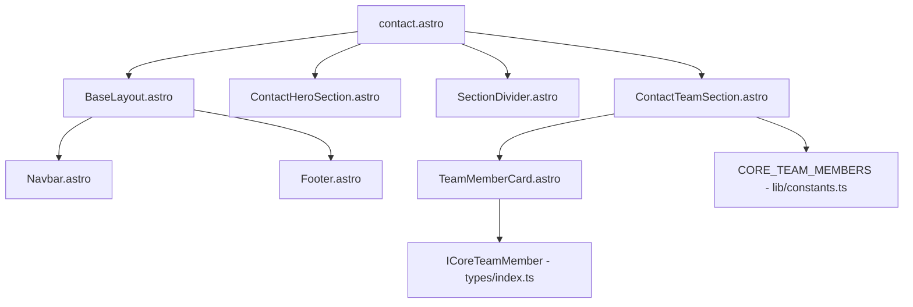
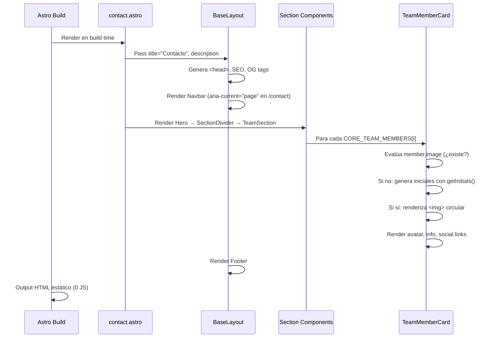
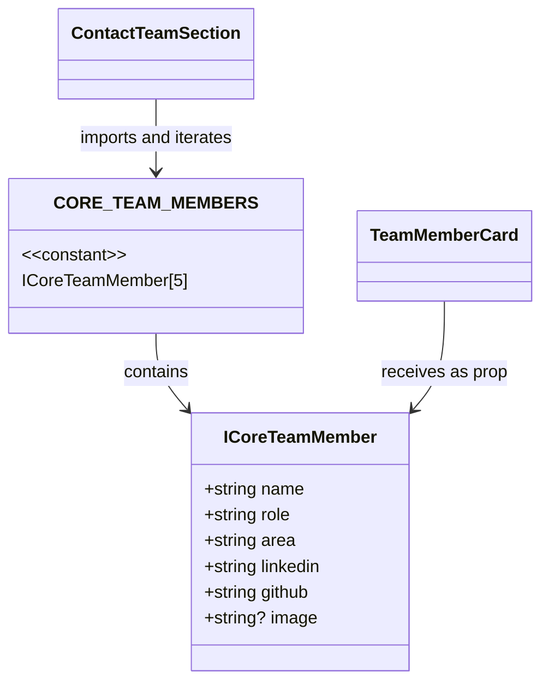

# Diseño Técnico — Página Contact

## Overview

La página `/contact` presenta al Core Team del AWS Student Builder Group Universidad del Valle mediante tarjetas interactivas de formato amplio con avatar prominente (96-120px, soporte condicional para imagen o placeholder con iniciales), nombre destacado, cargo, área como badge pill, y enlaces sociales integrados (LinkedIn, GitHub). El layout principal del Core Team utiliza **scroll horizontal con CSS scroll-snap** en desktop y mobile, priorizando a las personas como protagonistas visuales. Se integra completamente con el sistema de diseño existente (tema oscuro, acentos geométricos, animaciones float-*, hero-animate, data-animate) y cumple WCAG 2.1 AA.

### Decisiones Técnicas Principales

| Decisión | Justificación | Req. vinculado |
|----------|---------------|----------------|
| Scroll horizontal con CSS scroll-snap | Experiencia visual moderna, tarjetas amplias centradas en personas, navegación intuitiva | Req. 5.4, 5.6 |
| Avatares con soporte condicional (imagen o CSS+iniciales) | Preparado para S3 futuro sin refactoring; rendimiento 0 requests mientras no haya fotos | Req. 6.1–6.5 |
| Datos del team en `constants.ts` con `image?: string` | Separación datos/presentación, extensibilidad | Req. 3.1, 3.4 |
| Componente `TeamMemberCard.astro` independiente | Reutilizable en otras páginas | Req. 4.1, 14.2 |
| Composición simplificada: Hero → Divider → Team | Eliminación de Networking/CTA, foco exclusivo en el equipo | Req. 1.7 |
| HTML estático sin JS client-side | Rendimiento Lighthouse ≥95, zero JS bundle | Req. 13.1 |
| Hover con translateY(-6px) y glow accent | Interacciones premium sin exageración | Req. 11.3 |

## Architecture

### Diagrama de Componentes



### Flujo de Renderizado



### Estructura de Archivos

```
src/
├── pages/
│   └── contact.astro                        # Página principal (MODIFICAR - simplificar imports)
├── components/
│   ├── common/
│   │   ├── TeamMemberCard.astro             # Tarjeta de integrante (REESCRIBIR - avatar grande, hover mejorado)
│   │   └── SectionDivider.astro             # Existente, sin modificar
│   └── sections/
│       ├── ContactHeroSection.astro         # Hero section (MODIFICAR - reducir padding)
│       ├── ContactTeamSection.astro         # Scroll horizontal (REESCRIBIR)
│       ├── ContactNetworkingSection.astro   # (ELIMINAR)
│       └── ContactCtaSection.astro          # (ELIMINAR)
├── types/
│   └── index.ts                             # + campo image? en ICoreTeamMember (MODIFICAR)
└── lib/
    └── constants.ts                         # Sin cambios en datos
```

## Components and Interfaces

### 1. Interfaz `ICoreTeamMember` (actualizada)

**Archivo:** `src/types/index.ts`

```typescript
export interface ICoreTeamMember {
  /** Nombre completo del integrante */
  name: string;
  /** Cargo/rol en el equipo */
  role: string;
  /** Área de responsabilidad */
  area: string;
  /** URL completa del perfil de LinkedIn (HTTPS) */
  linkedin: string;
  /** URL completa del perfil de GitHub (HTTPS) */
  github: string;
  /** URL de imagen de perfil opcional (HTTPS, futuro S3) */
  image?: string;
}
```

**Cambio:** Se agrega el campo opcional `image?: string` para soportar integración futura con S3 sin refactorizar el componente. *(Req. 6.1)*

### 2. Constante `CORE_TEAM_MEMBERS`

**Archivo:** `src/lib/constants.ts`  
Sin cambios en los datos. El campo `image` no se define (queda como `undefined`) mientras no haya fotos reales subidas a S3.

### 3. Componente `TeamMemberCard.astro` (rediseñado)

**Archivo:** `src/components/common/TeamMemberCard.astro`

#### Props Interface

```typescript
interface Props {
  member: ICoreTeamMember;
  class?: string;
}
```

#### Lógica de Avatar Condicional

```typescript
function getInitials(name: string): string {
  const parts = name.split(' ');
  const first = parts[0]?.[0] ?? '';
  const last = parts[parts.length - 1]?.[0] ?? '';
  return (first + last).toUpperCase();
}

const initials = getInitials(member.name);
const hasImage = member.image && member.image.trim().length > 0;
```

#### Estructura del Markup

```html
<article class:list={['team-card', className]} data-animate>
  <!-- Elemento decorativo de esquina -->
  <div aria-hidden="true" class="card-decoration"></div>

  <!-- Avatar: imagen o placeholder con iniciales -->
  {hasImage ? (
    
  ) : (
    <div aria-hidden="true" class="avatar avatar-placeholder">
      <span>{initials}</span>
    </div>
  )}

  <!-- Info -->
  <h3 class="card-name">{member.name}</h3>
  <p class="card-role">{member.role}</p>
  <span class="card-area-badge">{member.area}</span>

  <!-- Enlaces sociales -->
  <div class="social-links">
    <a href={member.linkedin} target="_blank" rel="noopener noreferrer"
       aria-label={`LinkedIn de ${member.name}`} class="social-link">
      <!-- SVG LinkedIn inline (20×20) -->
      <span class="sr-only">(abre en nueva pestaña)</span>
    </a>
    <a href={member.github} target="_blank" rel="noopener noreferrer"
       aria-label={`GitHub de ${member.name}`} class="social-link">
      <!-- SVG GitHub inline (20×20) -->
      <span class="sr-only">(abre en nueva pestaña)</span>
    </a>
  </div>
</article>
```

#### Estilos Clave del TeamMemberCard

```css
.team-card {
  position: relative;
  overflow: hidden;
  background: var(--sbg-bg-surface);
  border: 1px solid var(--sbg-border);
  border-radius: 0.75rem;
  padding: 1.75rem;
  display: flex;
  flex-direction: column;
  align-items: center;
  text-align: center;
  gap: 0.5rem;
  min-width: 320px;
  max-width: 360px;
  transition: transform 300ms ease-out, box-shadow 300ms ease-out, border-color 300ms ease-out;
}

.team-card:hover {
  transform: translateY(-6px);
  box-shadow: 0 12px 32px rgba(0, 0, 0, 0.5);
  border-color: var(--sbg-accent-border);
}

.team-card:focus-within {
  outline: 2px solid var(--sbg-accent);
  outline-offset: 3px;
}

/* Avatar base */
.avatar {
  width: 96px;
  height: 96px;
  border-radius: 50%;
  margin-bottom: 0.5rem;
}

/* Placeholder con iniciales */
.avatar-placeholder {
  display: flex;
  align-items: center;
  justify-content: center;
  background: linear-gradient(135deg, var(--sbg-accent), var(--sbg-orange));
  font-family: 'Space Mono', monospace;
  font-weight: 700;
  font-size: 1.75rem;
  color: white;
}

/* Imagen de perfil */
.avatar-img {
  aspect-ratio: 1 / 1;
  object-fit: cover;
}

.card-name {
  font-size: 1.15rem;
  margin: 0;
}

.card-role {
  font-size: 0.85rem;
  color: var(--sbg-text-muted);
  margin: 0;
}

.card-area-badge {
  display: inline-block;
  font-family: 'Space Mono', monospace;
  font-size: 0.68rem;
  letter-spacing: 0.03em;
  padding: 0.3rem 0.85rem;
  border-radius: 9999px;
  background: var(--sbg-accent-subtle);
  color: var(--sbg-text-muted);
  margin-top: 0.25rem;
}

.social-links {
  display: flex;
  gap: 0.75rem;
  margin-top: 0.75rem;
}

.social-link {
  display: inline-flex;
  align-items: center;
  justify-content: center;
  min-width: 44px;
  min-height: 44px;
  padding: 0.5rem;
  border-radius: 0.5rem;
  color: var(--sbg-text-subtle);
  text-decoration: none;
  transition: color 200ms ease-out, background 200ms ease-out;
}

.social-link:hover {
  color: var(--sbg-accent-light);
  background: rgba(139, 92, 246, 0.08);
}

.card-decoration {
  position: absolute;
  top: 0;
  right: 0;
  width: 80px;
  height: 80px;
  background: linear-gradient(135deg, rgba(139, 92, 246, 0.08), transparent);
  border-radius: 0 0.75rem 0 100%;
  pointer-events: none;
}

@media (prefers-reduced-motion: reduce) {
  .team-card { transition: none; }
  .team-card:hover { transform: none; }
  .social-link { transition: none; }
}
```

**Máximo 150 líneas** (incluyendo markup, frontmatter y estilos). *(Req. 14.8)*

### 4. Componente `ContactHeroSection.astro` (modificado)

**Archivo:** `src/components/sections/ContactHeroSection.astro`

**Único cambio:** Reducir padding vertical de `py-20 lg:py-28` a `py-14 lg:py-20`.

```html
<section
  aria-labelledby="contact-hero-heading"
  class:list={['relative overflow-hidden py-14 lg:py-20', className]}
>
  <!-- Resto del contenido sin cambios -->
</section>
```

Todo lo demás se mantiene idéntico: radial gradients, dot grid, floating shapes, SVG de nodos, hero-animate con delays, grid 2 columnas con SVG decorativo en desktop. *(Req. 2.11)*

### 5. Componente `ContactTeamSection.astro` (reescrito con scroll horizontal)

**Archivo:** `src/components/sections/ContactTeamSection.astro`

#### Composición Visual

```
Desktop (≥1024px): Scroll horizontal con snap
┌────────────────────────────────────────────────────────────────────────┐
│  # contact.team                                                         │
│  Core Team                                                              │
│                                                                         │
│  ┌──────┐  ┌──────┐  ┌──────┐  ┌──────┐  ┌──                         │
│  │ Card │  │ Card │  │ Card │  │ Card │  │ Ca...  ← scroll →          │
│  │  1   │  │  2   │  │  3   │  │  4   │  │  5                         │
│  └──────┘  └──────┘  └──────┘  └──────┘  └──                         │
│  [gradiente fade izq]                    [gradiente fade der]          │
└────────────────────────────────────────────────────────────────────────┘

Tablet (≥640px <1024px): Grid 2 columnas
┌──────┐  ┌──────┐
│ Card │  │ Card │
└──────┘  └──────┘
┌──────┐  ┌──────┐
│ Card │  │ Card │
└──────┘  └──────┘
┌──────┐
│ Card │
└──────┘

Mobile (<640px): Scroll horizontal con peek
┌──────────────────────────┐
│  ┌──────┐  ┌───          │
│  │ Card │  │ Ca... peek  │  ← swipe →
│  │  1   │  │             │
│  └──────┘  └───          │
└──────────────────────────┘
```

#### Markup

```html
<section aria-labelledby="core-team-heading" class:list={['py-12 sm:py-16', className]}>
  <div class="container-sbg">
    <div class="mb-10 sm:mb-12" data-animate>
      <span class="code-label mb-3 block"># contact.team</span>
      <h2 id="core-team-heading" class="text-2xl sm:text-3xl">Core Team</h2>
    </div>

    <div class="scroll-wrapper" data-animate>
      <div class="team-scroll-container">
        {CORE_TEAM_MEMBERS.map((member) => (
          <TeamMemberCard member={member} />
        ))}
      </div>
      <!-- Indicador de scroll disponible (derecha) -->
      <div aria-hidden="true" class="scroll-fade-right"></div>
    </div>
  </div>
</section>
```

#### CSS del Scroll Horizontal

```css
.scroll-wrapper {
  position: relative;
}

.team-scroll-container {
  display: flex;
  gap: 24px;
  overflow-x: auto;
  scroll-snap-type: x mandatory;
  scroll-behavior: smooth;
  -webkit-overflow-scrolling: touch;
  scrollbar-width: none;
  padding-bottom: 8px; /* espacio para sombras en hover */
}

.team-scroll-container::-webkit-scrollbar {
  display: none;
}

.team-scroll-container > * {
  scroll-snap-align: start;
  flex-shrink: 0;
  min-width: 320px;
  max-width: 360px;
}

/* Tablet: grid 2 columnas */
@media (min-width: 640px) and (max-width: 1023px) {
  .team-scroll-container {
    display: grid;
    grid-template-columns: repeat(2, 1fr);
    overflow-x: visible;
    scroll-snap-type: none;
  }
  .team-scroll-container > * {
    min-width: unset;
    max-width: unset;
  }
  .scroll-fade-right {
    display: none;
  }
}

/* Indicador de scroll (gradiente fade en borde derecho) */
.scroll-fade-right {
  position: absolute;
  right: 0;
  top: 0;
  bottom: 0;
  width: 60px;
  background: linear-gradient(to right, transparent, var(--sbg-bg));
  pointer-events: none;
  z-index: 2;
}
```

**Características del scroll:**
- Desktop (≥1024px): Flex con overflow-x auto, scroll-snap-type: x mandatory, tarjetas 320-360px, múltiples visibles
- Tablet (≥640px <1024px): Grid 2 columnas, sin scroll
- Mobile (<640px): Scroll horizontal con snap, una tarjeta + peek del siguiente
- Scrollbar oculta visualmente, funcionalidad mantenida
- NO carrusel automático, control exclusivo del usuario
- Accesible con teclado (Tab entre tarjetas), mouse, touchpad y gestos touch

*(Req. 5.4–5.12)*

### 6. Página `contact.astro` (simplificada)

**Archivo:** `src/pages/contact.astro`

```astro
---
import BaseLayout from '@/layouts/BaseLayout.astro';
import ContactHeroSection from '@/components/sections/ContactHeroSection.astro';
import ContactTeamSection from '@/components/sections/ContactTeamSection.astro';
import SectionDivider from '@/components/common/SectionDivider.astro';
---

<BaseLayout
  title="Contacto"
  description="Conoce al Core Team del AWS Student Builder Group Univalle: líderes, áreas y cómo conectar profesionalmente con la comunidad."
>
  <ContactHeroSection />
  <SectionDivider />
  <ContactTeamSection />
</BaseLayout>
```

**Cambios:**
- Eliminados imports de `ContactNetworkingSection` y `ContactCtaSection`
- Eliminados SectionDividers extra
- Composición final: Hero → SectionDivider → TeamSection

**Validación meta description:** 138 caracteres ✓ (entre 120 y 160). *(Req. 1.1, 1.7)*

### 7. Componentes Eliminados

| Componente | Acción | Justificación |
|-----------|--------|---------------|
| `ContactNetworkingSection.astro` | ELIMINAR | No se requiere en la composición simplificada |
| `ContactCtaSection.astro` | ELIMINAR | Sin URL de CTA válida actualmente |

*(Req. 14.11)*

## Data Models

### Modelo de Datos del Core Team



### Flujo de Datos

1. `CORE_TEAM_MEMBERS` se define en `src/lib/constants.ts` como array de 5 objetos `ICoreTeamMember`
2. `ContactTeamSection` importa la constante y la itera con `.map()`
3. Cada iteración pasa un `ICoreTeamMember` como prop `member` a `TeamMemberCard`
4. `TeamMemberCard` evalúa `member.image`:
   - Si está definido y no vacío → renderiza `` circular
   - Si es `undefined` o vacío → renderiza placeholder con iniciales (`getInitials()`)
5. Ambos estados ocupan el mismo espacio visual (96-120px circular)

### Relación con Datos Existentes

- `NAV_LINKS` ya contiene `{ href: '/contact', label: 'Contacto' }` → no requiere modificación
- `SITE_CONFIG.social.*` ya no se usa directamente en esta página (se eliminaron Networking y CTA)

## Correctness Properties

*Sección omitida intencionalmente.* Esta feature es una página estática de UI renderizada en build time con datos fijos (5 miembros). No contiene funciones puras con inputs variables, algoritmos con espacio de entrada amplio, ni lógica de negocio que varíe con diferentes inputs. Property-Based Testing no es apropiado para este tipo de feature (UI rendering, datos estáticos, CSS scroll-snap). Se utilizan tests example-based, validación de tipos en compile-time y auditorías Lighthouse en su lugar.

## Error Handling

### Manejo de Casos Edge

| Caso | Estrategia | Componente |
|------|-----------|------------|
| Nombre sin apellido | `getInitials()` retorna solo primera letra duplicada | TeamMemberCard |
| Campo `image` vacío (`""`) | Tratado como no definido → renderiza placeholder | TeamMemberCard |
| Campo `image` con URL inválida | El `` falla silenciosamente; no rompe el layout | TeamMemberCard |
| URL social vacía | No aplica: todos los campos sociales son obligatorios en `ICoreTeamMember` | — |
| Viewport muy estrecho (320px) | Scroll horizontal con una tarjeta visible + peek | ContactTeamSection |
| Sin soporte scroll-snap | Graceful degradation: scroll normal funciona, solo pierde el snap | ContactTeamSection |
| Sin soporte IntersectionObserver | Fallback: añade `animate-in` inmediatamente (ya implementado en BaseLayout) | BaseLayout script |
| `prefers-reduced-motion: reduce` | CSS global elimina todas las animaciones, muestra contenido con opacity:1 | global.css |

### Validación en Build Time

- TypeScript strict mode valida que todos los campos obligatorios de `ICoreTeamMember` estén presentes
- Si un campo falta en `CORE_TEAM_MEMBERS`, el build falla con error de tipo
- El campo `image?` es opcional: no genera error si no está definido
- No se requiere validación runtime porque los datos son estáticos

## Testing Strategy

### Por qué NO se usa Property-Based Testing

Esta feature es una página estática de UI renderizada en build time con datos fijos (5 miembros hardcodeados). No contiene:
- Funciones puras con inputs variables del usuario
- Algoritmos con espacio de entrada amplio
- Transformaciones de datos complejas
- Lógica de negocio que varíe con diferentes inputs

La única función "pura" (`getInitials`) opera sobre exactamente 5 inputs conocidos en compile time. No hay beneficio en generar 100+ inputs aleatorios cuando el dominio completo del problema es 5 strings fijos.

### Estrategia de Testing Recomendada

#### 1. Verificación de Tipos (Compile-time)

```bash
npx tsc --noEmit
```

Valida:
- `ICoreTeamMember` interface con campo `image?` correctamente definida
- `CORE_TEAM_MEMBERS` cumple con el tipo
- Props de `TeamMemberCard` correctamente tipadas
- Imports con alias `@/` resuelven
- No hay imports rotos a componentes eliminados

#### 2. Build Validation

```bash
astro build
```

Valida:
- Todos los componentes renderizan sin errores
- No hay imports de `ContactNetworkingSection` ni `ContactCtaSection`
- HTML estático generado correctamente
- Scroll container CSS válido

#### 3. Tests Unitarios (Example-based)

| Test | Qué verifica | Req. |
|------|-------------|------|
| Meta title es "Contacto \| AWS SBG Univalle" | SEO correcto | 1.2 |
| Composición: Hero → Divider → Team (sin Networking ni CTA) | Estructura simplificada | 1.7 |
| Estructura semántica: h1 → h2 → h3 sin saltos | Jerarquía de headings | 9.4 |
| Todos los enlaces externos tienen `target="_blank"` y `rel="noopener noreferrer"` | Seguridad | 10.1 |
| Todas las URLs exactas presentes sin modificación | Integridad de datos | 10.2 |
| Cada enlace tiene `aria-label` con nombre del integrante | Accesibilidad | 4.7 |
| 5 TeamMemberCards renderizadas | Completitud de datos | 5.1 |
| Elementos decorativos tienen `aria-hidden="true"` | Accesibilidad | 9.3 |
| span.sr-only "(abre en nueva pestaña)" en cada enlace externo | Accesibilidad | 10.3 |
| `getInitials("Miguel Ángel Sanclemente Mejía")` = "MM" | Lógica de iniciales | 4.3 |
| Meta description entre 120-160 caracteres | SEO | 1.1 |
| Avatar placeholder cuando `image` no definido | Renderizado condicional | 6.3 |
| Avatar `` cuando `image` definido | Renderizado condicional | 6.2 |
| Hero usa `py-14 lg:py-20` (padding reducido) | Composición visual | 7.1 |
| Scroll container tiene `scroll-snap-type: x mandatory` | Layout scroll | 5.4 |

#### 4. Lighthouse Audit

| Métrica | Umbral | Req. |
|---------|--------|------|
| Performance | ≥ 95 | 13.4 |
| Accessibility | ≥ 90 | 9 |
| SEO | ≥ 95 | 1 |
| Best Practices | ≥ 95 | — |
| LCP | < 2.5s mobile | 13.6 |
| Transfer size | ≤ 300KB | 13.5 |

#### 5. Tests de Accesibilidad

- Axe-core scan del HTML renderizado
- Verificación de contraste 4.5:1 para texto normal
- Navegación completa por teclado (Tab entre tarjetas del scroll)
- Skip link funcional → focus en `#main-content`
- Scroll container navegable con teclado sin trampa de foco

#### 6. Tests Responsive (Visual)

| Viewport | Verificación |
|----------|-------------|
| 320px | Scroll horizontal con snap, 1 card + peek, touch targets ≥44px, sin scroll de página |
| 640px | Grid 2 columnas, sin scroll horizontal en container |
| 1024px | Scroll horizontal con snap, múltiples tarjetas visibles, SVG hero visible |
| 2560px | Sin overflow de página, contenido centrado, scroll funcional |

### Herramientas de Testing

- **TypeScript compiler** (`tsc --noEmit`): Validación de tipos en build
- **Astro build** (`astro build`): Validación de renderizado
- **Lighthouse CI**: Performance, accesibilidad, SEO
- **axe-core** (futuro): Accesibilidad automatizada
- **Playwright** (futuro): Tests E2E responsive, scroll behavior y interacción

---

## Evolución Futura

### CTA Section

En una iteración futura, si se proporciona una URL válida para un CTA (formulario de inscripción, enlace de WhatsApp verificado, etc.), se puede agregar una sección CTA al final de la página siguiendo el patrón de `AboutCtaSection.astro`. La composición pasaría a ser: Hero → SectionDivider → TeamSection → SectionDivider → CtaSection.

### Imágenes de Perfil (S3)

Cuando las fotografías del equipo estén disponibles en S3, basta con agregar el campo `image` a cada miembro en `CORE_TEAM_MEMBERS`. El componente `TeamMemberCard` ya soporta el renderizado condicional sin necesidad de refactoring.
