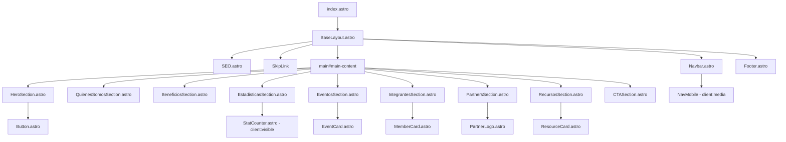
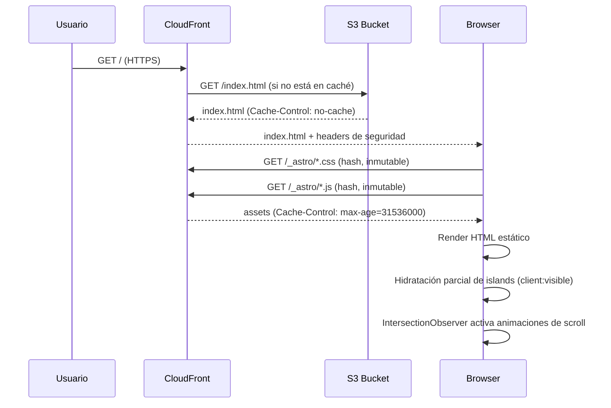
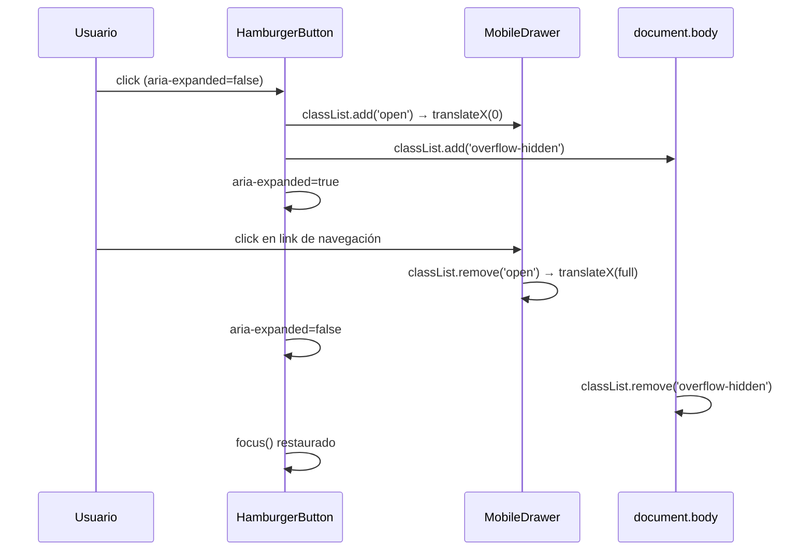

# Design Document: Landing Page — AWS SBG Univalle

## Overview

La Landing Page (`/`) es la presencia digital principal del AWS Student Builder Group de la Universidad del Valle. Actúa como punto de entrada para estudiantes, profesores y empresas; presenta el grupo, sus actividades y facilita la incorporación de nuevos miembros. Se construye con Astro 5 + TypeScript strict + TailwindCSS sobre una arquitectura de sitio estático desplegado en S3 + CloudFront.

El sitio es completamente estático (SSG), lo que garantiza Lighthouse Performance ≥ 95. Todas las secciones se renderizan en build-time; los únicos scripts de cliente son los estrictamente necesarios (contador animado, menú hamburger, intersection observer para animaciones de scroll).

El diseño sigue los tokens del sistema de diseño SBG: azul Univalle (`#003087`) como color primario y naranja AWS (`#FF9900`) como acento. La tipografía combina Plus Jakarta Sans (headings) e Inter (body). La arquitectura de componentes sigue la estructura `src/components/sections/`, `src/components/layout/` y `src/components/common/`.

## Architecture




### Flujo de carga inicial



### Interacción menú mobile




## Components and Interfaces

### BaseLayout.astro

**Propósito**: Layout raíz de todas las páginas. Inyecta head SEO, fuentes, skip link, Navbar y Footer.

```typescript
interface Props {
  title: string;
  description: string;
  canonical?: string;  // URL canónica absoluta
  ogImage?: string;    // URL imagen OG 1200x630px
}
```

**Responsabilidades**: renderizar skip link como primer elemento del body, precargar fuentes críticas, inyectar JSON-LD Organization, envolver contenido en `<main id="main-content">`.

---

### SEO.astro

```typescript
interface Props {
  title: string;
  description: string;
  canonical: string;
  ogImage: string;
  ogType?: 'website' | 'article';
  noindex?: boolean;
}
```

---

### HeroSection.astro

```typescript
interface Props {
  headline: string;
  subheadline: string;
  ctaPrimary: { label: string; href: string };
  ctaSecondary: { label: string; href: string };
  heroImage: ImageMetadata;    // importado desde astro:assets
  heroImageAlt: string;
}
```

---

### EstadisticasSection.astro

```typescript
interface IStat {
  value: number;      // entero positivo
  suffix?: string;    // '+', '%', 'k'
  label: string;
  icon: string;       // nombre icono Lucide
}

interface Props {
  stats: IStat[];
}
```

---

### EventosSection.astro

```typescript
interface IEvent {
  title: string;           // máx 80 chars
  date: Date;
  endDate?: Date;
  location: string;
  type: 'workshop' | 'hackathon' | 'charla' | 'otro';
  description: string;     // máx 300 chars para preview
  registrationUrl?: string;
  image?: ImageMetadata;
  imageAlt?: string;
  tags: string[];          // mín 1, máx 5
  isFeatured?: boolean;
}

interface Props {
  events: IEvent[];
  limit?: number;
}
```

---

### IntegrantesSection.astro

```typescript
interface IMember {
  name: string;
  role: string;
  bio?: string;           // máx 200 chars
  photo?: ImageMetadata;
  photoAlt?: string;      // obligatorio si photo presente
  linkedin?: string;
  github?: string;
  isDirective: boolean;
}

interface Props {
  members: IMember[];
}
```

---

### PartnersSection.astro

```typescript
interface IPartner {
  name: string;
  logo: ImageMetadata;
  logoAlt: string;
  url?: string;
  tier?: 'gold' | 'silver' | 'community';
}

interface Props {
  partners: IPartner[];
}
```

---

### RecursosSection.astro

```typescript
interface IResource {
  title: string;
  description: string;
  url: string;
  category: 'documentacion' | 'curso' | 'certificacion' | 'herramienta' | 'comunidad';
  icon?: string;
  isExternal: boolean;
}

interface Props {
  resources: IResource[];
  limit?: number;
}
```

---

### Button.astro (common)

```typescript
interface Props {
  variant: 'primary' | 'secondary' | 'ghost';
  size?: 'sm' | 'md' | 'lg';
  href?: string;       // si existe, renderiza <a>; si no, <button>
  type?: 'button' | 'submit' | 'reset';
  disabled?: boolean;
  ariaLabel?: string;
  class?: string;
}
```

---

### StatCounter.astro (common, island `client:visible`)

```typescript
interface Props {
  target: number;
  suffix?: string;
  duration?: number;   // ms, default 2000
  label: string;
  icon: string;
}
```


## Data Models

### IEvent

```typescript
interface IEvent {
  title: string;           // máx 80 chars, requerido, no vacío
  date: Date;              // fecha válida, requerido
  endDate?: Date;          // si presente, debe ser > date
  location: string;        // nombre del lugar o "Virtual"
  type: 'workshop' | 'hackathon' | 'charla' | 'otro';
  description: string;     // máx 300 chars para preview card
  registrationUrl?: string; // URL válida HTTPS si presente
  image?: ImageMetadata;
  imageAlt?: string;        // obligatorio si image presente
  tags: string[];           // mín 1, máx 5 elementos
  isFeatured?: boolean;
  isPast?: boolean;         // calculado: date < now()
}
```

**Reglas de validación**:
- `title` no puede estar vacío
- `date` debe ser instancia válida de Date (no NaN)
- Si `registrationUrl` presente, debe comenzar con `https://`
- `tags.length` entre 1 y 5

---

### IMember

```typescript
interface IMember {
  name: string;            // nombre completo, no vacío
  role: string;            // cargo en el grupo
  bio?: string;            // máx 200 chars
  photo?: ImageMetadata;
  photoAlt?: string;       // obligatorio si photo presente
  linkedin?: string;       // URL linkedin.com/in/...
  github?: string;         // URL github.com/...
  isDirective: boolean;
}
```

---

### IStat

```typescript
interface IStat {
  value: number;       // entero positivo ≥ 0
  suffix?: string;     // '+', '%', 'k'
  label: string;       // descripción legible, no vacía
  icon: string;        // nombre válido de icono Lucide
}
```

---

### IPartner

```typescript
interface IPartner {
  name: string;         // no vacío
  logo: ImageMetadata;  // requerido
  logoAlt: string;      // descripción del logo, no vacío
  url?: string;         // URL HTTPS si presente
  tier?: 'gold' | 'silver' | 'community';
}
```

---

### IResource

```typescript
interface IResource {
  title: string;
  description: string;
  url: string;          // URL válida, HTTPS para externos
  category: 'documentacion' | 'curso' | 'certificacion' | 'herramienta' | 'comunidad';
  icon?: string;
  isExternal: boolean;
}
```

---

### ISiteConfig

```typescript
interface ISiteConfig {
  name: string;          // nombre del grupo
  shortName: string;     // nombre corto para metadatos
  url: string;           // URL base HTTPS del sitio
  description: string;
  logo: string;          // ruta al logo
  ogImage: string;       // ruta imagen OG por defecto
  social: {
    instagram?: string;
    linkedin?: string;
    github?: string;
    twitter?: string;
    whatsapp?: string;
  };
}
```


## Algorithmic Pseudocode

### Contador Animado (StatCounter)

```pascal
ALGORITHM animateCounter
INPUT: target: number, duration: number, element: HTMLElement, suffix: string
OUTPUT: elemento DOM actualizado con animación de conteo

PRECONDITIONS:
  - target >= 0
  - duration > 0
  - element exists in DOM
  - prefers-reduced-motion puede estar activo

BEGIN
  IF window.matchMedia('prefers-reduced-motion: reduce').matches THEN
    element.textContent ← target + suffix
    RETURN
  END IF

  startTime ← null
  startValue ← 0

  PROCEDURE step(timestamp)
    IF startTime IS null THEN
      startTime ← timestamp
    END IF

    elapsed ← timestamp - startTime
    progress ← MIN(elapsed / duration, 1)
    easedProgress ← 1 - (1 - progress)^3   // easing ease-out cubic

    current ← FLOOR(startValue + (target - startValue) * easedProgress)
    element.textContent ← current + suffix

    IF progress < 1 THEN
      requestAnimationFrame(step)
    END IF
  END PROCEDURE

  requestAnimationFrame(step)
END

POSTCONDITIONS:
  - element.textContent = target + suffix cuando animación completa
  - No side effects en otros elementos del DOM
  - Respeta prefers-reduced-motion

LOOP INVARIANTS:
  - 0 ≤ progress ≤ 1 en cada frame
  - startValue ≤ current ≤ target en cada frame
```

---

### Animaciones de Scroll (IntersectionObserver)

```pascal
ALGORITHM initScrollAnimations
INPUT: selector: string = '[data-animate]'
OUTPUT: elementos con clase 'animate-in' al entrar en viewport

PRECONDITIONS:
  - DOM completamente cargado
  - selector es string CSS válido

BEGIN
  IF prefers-reduced-motion IS active THEN
    FOR each element IN document.querySelectorAll(selector) DO
      element.classList.add('visible')
    END FOR
    RETURN
  END IF

  observer ← new IntersectionObserver(
    callback: onIntersect,
    options: { threshold: 0.15, rootMargin: '0px 0px -50px 0px' }
  )

  FOR each element IN document.querySelectorAll(selector) DO
    observer.observe(element)
  END FOR

  PROCEDURE onIntersect(entries)
    FOR each entry IN entries DO
      IF entry.isIntersecting THEN
        entry.target.classList.add('animate-in')
        observer.unobserve(entry.target)  // solo una vez
      END IF
    END FOR
  END PROCEDURE
END

POSTCONDITIONS:
  - Cada elemento recibe 'animate-in' exactamente una vez
  - Con prefers-reduced-motion: todos visibles sin animación

LOOP INVARIANTS:
  - Ningún elemento es observado más de una vez después de intersectar
```

---

### Toggle Menú Mobile

```pascal
ALGORITHM toggleMobileMenu
INPUT: triggerButton: HTMLButtonElement, drawer: HTMLElement
OUTPUT: estado del menú actualizado con accesibilidad correcta

PRECONDITIONS:
  - triggerButton.getAttribute('aria-expanded') IN ['true', 'false']
  - drawer element existe en DOM

BEGIN
  isOpen ← triggerButton.getAttribute('aria-expanded') = 'true'

  IF isOpen THEN
    drawer.classList.remove('translate-x-0')
    drawer.classList.add('translate-x-full')
    triggerButton.setAttribute('aria-expanded', 'false')
    document.body.classList.remove('overflow-hidden')
    triggerButton.focus()
  ELSE
    drawer.classList.remove('translate-x-full')
    drawer.classList.add('translate-x-0')
    triggerButton.setAttribute('aria-expanded', 'true')
    document.body.classList.add('overflow-hidden')
    firstFocusable ← drawer.querySelector('a, button')
    IF firstFocusable IS NOT null THEN
      firstFocusable.focus()
    END IF
  END IF
END

POSTCONDITIONS:
  - aria-expanded refleja el estado visual del drawer
  - body overflow bloqueado cuando menú abierto
  - foco se mueve al drawer al abrir / al trigger al cerrar
```


## Key Functions with Formal Specifications

### `formatEventDate(date: Date, locale?: string): string`

**Precondiciones**:
- `date` es instancia válida de `Date` (no NaN)
- `locale` si presente, es BCP 47 locale string válido

**Postcondiciones**:
- Retorna string no vacío en formato legible (ej: "15 de marzo de 2025")
- Locale por defecto: `es-CO`
- No modifica el objeto `date` de entrada

**Loop Invariants**: N/A

---

### `filterUpcomingEvents(events: IEvent[], limit: number): IEvent[]`

**Precondiciones**:
- `events` es array (puede ser vacío)
- `limit` es entero > 0
- Cada elemento tiene `date` válido

**Postcondiciones**:
- Resultado contiene solo eventos con `date >= Date.now()`
- Resultado ordenado ascendentemente por `date`
- `result.length <= limit`
- No modifica el array `events` de entrada (retorna nuevo array)

**Loop Invariants**:
- Todos los elementos del subarray procesado hasta índice `i` tienen `date >= Date.now()`

---

### `buildJsonLdOrganization(config: ISiteConfig): Record<string, unknown>`

**Precondiciones**:
- `config.name` no está vacío
- `config.url` comienza con `https://`
- `config.logo` es path válido

**Postcondiciones**:
- Retorna objeto con `@context: "https://schema.org"` y `@type: "Organization"`
- El objeto es serializable a JSON sin errores
- Incluye campos: `name`, `url`, `logo`, `sameAs`

## Example Usage

```typescript
---
// src/pages/index.astro
import BaseLayout from '@/layouts/BaseLayout.astro';
import HeroSection from '@/components/sections/HeroSection.astro';
import EstadisticasSection from '@/components/sections/EstadisticasSection.astro';
import EventosSection from '@/components/sections/EventosSection.astro';
import heroImage from '@/assets/images/hero-illustration.svg';
import { STATS, UPCOMING_EVENTS, DIRECTIVE_MEMBERS, PARTNERS, FEATURED_RESOURCES } from '@/lib/constants';
---

<BaseLayout
  title="AWS Student Builder Group — Universidad del Valle"
  description="Comunidad estudiantil de tecnología cloud AWS en la Universidad del Valle."
>
  <HeroSection
    headline="Construye el futuro en la nube"
    subheadline="Aprende, construye y conecta con los mejores builders de Colombia."
    ctaPrimary={{ label: 'Únete al grupo', href: '#cta' }}
    ctaSecondary={{ label: 'Ver eventos', href: '#eventos' }}
    heroImage={heroImage}
    heroImageAlt="Ilustración de estudiantes construyendo en la nube AWS"
  />
  <EstadisticasSection stats={STATS} />
  <EventosSection events={UPCOMING_EVENTS} limit={3} />
</BaseLayout>
```

```typescript
// src/lib/utils.ts
export function filterUpcomingEvents(events: IEvent[], limit: number): IEvent[] {
  const now = Date.now();
  return events
    .filter(e => e.date.getTime() >= now)
    .sort((a, b) => a.date.getTime() - b.date.getTime())
    .slice(0, limit);
}

export function formatEventDate(date: Date, locale = 'es-CO'): string {
  return date.toLocaleDateString(locale, { day: 'numeric', month: 'long', year: 'numeric' });
}
```


## Correctness Properties

- Para toda sección `S` en la página, `S` tiene un `<section>` con `aria-labelledby` apuntando al `id` de su `<h2>`.
- Para todo elemento interactivo `E`, `E` tiene estado `focus-visible` con ring naranja `#FF9900` de contraste ≥ 3:1.
- Para toda imagen `I`, `I` tiene atributo `alt` (descriptivo para imágenes informativas, vacío para decorativas).
- Para todo contador `C` en `EstadisticasSection`, el valor final de `C` tras la animación es exactamente `target + suffix`.
- Para todo evento `E` en `EventosSection`, `E.date >= Date.now()` (solo se muestran eventos futuros).
- La página tiene exactamente un `<main id="main-content">` y exactamente un skip link `<a href="#main-content">`.
- El Navbar tiene `aria-expanded` sincronizado con el estado visual del drawer en todo momento.
- Para todo `<a target="_blank">`, el elemento tiene `rel="noopener noreferrer"`.
- `filterUpcomingEvents(events, limit).length <= limit` para cualquier valor de `events` y `limit > 0`.

## Error Handling

### Sin foto de miembro

**Condición**: `member.photo` es `undefined`.
**Respuesta**: Mostrar avatar placeholder con iniciales del nombre, fondo `--sbg-bg-muted`, texto `--sbg-primary`.
**Recuperación**: Estado válido permanente; no se requiere intervención.

### Sin eventos próximos

**Condición**: `filterUpcomingEvents()` retorna array vacío.
**Respuesta**: Mostrar estado vacío con mensaje "No hay eventos próximos programados" y botón a redes sociales del grupo.
**Recuperación**: La sección se renderiza sin cards y sin errores.

### Sin URL de registro

**Condición**: `event.registrationUrl` es `undefined`.
**Respuesta**: No renderizar botón "Registrarse". Solo mostrar información del evento.

### Sin imagen OG configurada

**Condición**: `ogImage` no se pasa al `BaseLayout`.
**Respuesta**: Usar imagen OG por defecto `/images/og-default.png` definida en `SITE_CONFIG`.

## Testing Strategy

### Unit Testing

Verificar en `src/lib/utils.ts`:
- `formatEventDate()`: fechas válidas, distintos locales, fecha epoch 0.
- `filterUpcomingEvents()`: array vacío, todos pasados, todos futuros, mezcla, límite = 1.
- `buildJsonLdOrganization()`: output tiene `@context`, `@type`, y campos requeridos.

### Property-Based Testing

Librería: **fast-check** (compatible con Node/Vitest).

Propiedades:
- `∀ n ≥ 0 → animateCounter finaliza con display = n + suffix`
- `∀ events, limit > 0 → filterUpcomingEvents(events, limit).length ≤ limit`
- `∀ events → filterUpcomingEvents(events, limit) todos tienen date ≥ now()`
- `∀ events → filterUpcomingEvents retorna array nuevo (no modifica entrada)`

### Accessibility Testing

- `axe-core` sobre página renderizada: 0 violaciones WCAG 2.1 AA críticas o serias.
- Navegación completa con teclado verificada manualmente.
- Contraste de todos los pares texto/fondo verificado con herramienta de contraste.

### Performance Testing

- Lighthouse CI en cada PR: Performance ≥ 95, SEO ≥ 95, Accessibility ≥ 90.
- LCP < 2.5s en conexión 4G simulada.
- CLS < 0.1 (todas las imágenes con `width` y `height` explícitos).

## Performance Considerations

- **Hero image**: formato WebP/AVIF vía `<Image />`, `fetchpriority="high"`, sin `loading="lazy"`.
- **Imágenes fuera del viewport**: `loading="lazy"` en miembros, partners y eventos.
- **Fuentes**: `<link rel="preload">` para Plus Jakarta Sans 700 e Inter 400. `font-display: swap`.
- **Islands**: Solo 3 islands con `client:visible` — `StatCounter`, menú mobile, scroll animations. Todo lo demás es HTML estático.
- **CSS**: Tailwind purga clases no usadas en build. Sin CSS externo bloqueante.
- **Prefetch**: links del navbar con `<link rel="prefetch">` para navegación instantánea a `/events`, `/resources`.

## Security Considerations

- **CSP**: `default-src 'self'` con fuentes self-hosted via `@fontsource`. Ajustar si se añaden recursos externos.
- **Headers**: Configurados en CloudFront Response Headers Policy (ver `aws.md`): HSTS, X-Frame-Options, X-Content-Type-Options.
- **Links externos**: Todos `<a target="_blank">` con `rel="noopener noreferrer"`.
- **No secretos en bundle**: Ninguna credencial AWS o token en código frontend.

## Dependencies

| Paquete | Versión | Justificación |
|---------|---------|---------------|
| `astro` | `^5.x` | Framework base (ya instalado) |
| `@astrojs/tailwind` | `^5.x` | Integración TailwindCSS (ya instalado) |
| `tailwindcss` | `^3.x` | Estilos utilitarios (ya instalado) |
| `typescript` | `^5.x` | Tipado estricto (ya instalado) |
| `lucide` | latest | Iconografía SVG |
| `@fontsource/inter` | `^5.x` | Fuente Inter self-hosted |
| `@fontsource/plus-jakarta-sans` | `^5.x` | Fuente display self-hosted |

No se requieren frameworks JS adicionales (React, Vue, etc.) para el MVP de la landing page.
