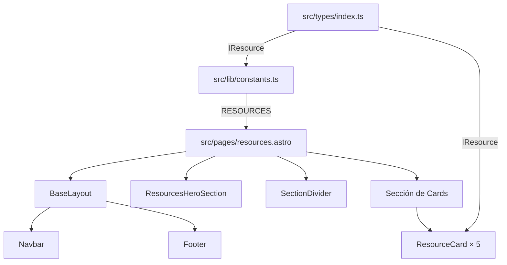
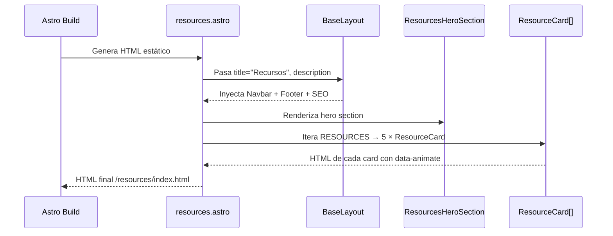

# Documento de Diseño — Página de Recursos

## Overview

La página `/resources` presenta una guía visual curada de 5 recursos oficiales de AWS para estudiantes. Se implementa como una página estática Astro que reutiliza los componentes existentes (BaseLayout, Navbar, Footer, SectionDivider) y sigue fielmente el Design System del sitio (tema oscuro, gradientes radiales, dot grids, formas geométricas flotantes, animaciones de scroll).

La arquitectura es simple y predecible: datos tipados en `constants.ts` → renderizados por componentes Astro → HTML estático generado en build time sin JavaScript client-side adicional.

## Architecture

### Diagrama de Componentes



### Flujo de Renderizado



### Decisiones de Arquitectura

| Decisión | Justificación |
|----------|---------------|
| Datos en `constants.ts` (no Content Collections) | Solo 5 recursos estáticos, sin necesidad de markdown ni frontmatter. Mantiene coherencia con `FEATURED_RESOURCES` existente. |
| Hero como componente de sección dedicado | Sigue el patrón de `AboutHeroSection.astro` y `HeroSection.astro`. Permite reutilización futura. |
| `ResourceCard` en `components/common/` | Es un componente reutilizable genérico que podría usarse en Home o en otras páginas. |
| Sin JavaScript client-side adicional | El IntersectionObserver ya existe en BaseLayout. Las animaciones son CSS puro. Cumple requisito de 0 JS extra. |
| Grid CSS nativo con Tailwind | Responsive sin librerías adicionales. Mobile-first con breakpoints `sm:` y `lg:`. |

## Components and Interfaces

### 1. `src/pages/resources.astro`

Página principal. Orquesta el layout y renderiza las secciones.

```typescript
// Frontmatter
import BaseLayout from '@/layouts/BaseLayout.astro';
import ResourcesHeroSection from '@/components/sections/ResourcesHeroSection.astro';
import ResourceCard from '@/components/common/ResourceCard.astro';
import SectionDivider from '@/components/common/SectionDivider.astro';
import { RESOURCES } from '@/lib/constants';
```

**Responsabilidades:**
- Pasar `title="Recursos"` y `description` a BaseLayout
- Renderizar `ResourcesHeroSection`
- Renderizar `SectionDivider` entre hero y cards
- Renderizar la sección de cards con grid responsive
- Incluir elementos decorativos de fondo entre secciones

### 2. `src/components/sections/ResourcesHeroSection.astro`

Hero banner con título, code-label, párrafo introductorio y elementos decorativos.

```typescript
interface Props {
  class?: string;
}
```

**Estructura HTML:**
```html
<section aria-labelledby="resources-hero-heading">
  <!-- Radial gradients decorativos -->
  <!-- Dot grid pattern -->
  <!-- Formas geométricas flotantes (4-5 elementos) -->
  <div class="container-sbg">
    <span class="hero-animate hero-animate-delay-1 code-label"># resources.learn_aws</span>
    <h1 id="resources-hero-heading" class="hero-animate hero-animate-delay-2">Recursos</h1>
    <p class="hero-animate hero-animate-delay-3">...</p>
  </div>
</section>
```

**Patrones visuales (idénticos a AboutHeroSection):**
- Gradiente naranja: `radial-gradient(ellipse 55% 45% at 30% 0%, rgba(255,153,0,0.08) 0%, transparent 65%)`
- Gradiente azul oscuro: `radial-gradient(ellipse at 80% 100%, rgba(35,47,62,0.35) 0%, transparent 60%)`
- Dot grid: `radial-gradient(circle, #fff 1px, transparent 1px)` con `background-size: 36px 36px` y `opacity-[0.025]`
- Formas flotantes: 4-5 elementos con `float-triangle`, `float-circle`, `float-square`, `float-rhombus`

### 3. `src/components/common/ResourceCard.astro`

Card individual para un recurso educativo.

```typescript
import type { IResource } from '@/types/index';

interface Props {
  resource: IResource;
  accentColor: string;
}
```

**Estructura HTML:**
```html
<article class="resource-card" data-animate>
  <div class="card-wrapper">
    <!-- Icono SVG inline con color de acento -->
    <div class="icon-container">
      <svg aria-hidden="true" ...><!-- Icono según resource.icon --></svg>
    </div>
    <!-- Badge de categoría -->
    <span class="category-badge">{resource.category}</span>
    <!-- Heading -->
    <h3>{resource.title}</h3>
    <!-- Descripción -->
    <p>{resource.description}</p>
    <!-- Enlace externo -->
    <a href={resource.url} target="_blank" rel="noopener noreferrer"
       aria-label={`Visitar ${resource.title} (abre en nueva pestaña)`}>
      Visitar recurso
      <svg aria-hidden="true"><!-- Icono enlace externo 16px --></svg>
      <span class="sr-only">(abre en nueva pestaña)</span>
    </a>
  </div>
</article>
```

**Estilos clave:**
- Fondo: `bg-[var(--sbg-bg-surface)]`
- Borde: `border border-[var(--sbg-border)] rounded-xl`
- Hover: `translateY(-2px)`, `shadow-md`, borde con mayor opacidad
- Transición: `transition-all duration-200 ease-out`
- Animación de entrada: `data-animate` (IntersectionObserver del BaseLayout)

### 4. Sección de Cards (dentro de `resources.astro`)

```html
<section aria-labelledby="resources-explore-heading">
  <!-- Elementos decorativos de fondo -->
  <div class="container-sbg">
    <span class="code-label"># resources.explore</span>
    <h2 id="resources-explore-heading">Explora los recursos</h2>
    
    <div class="grid grid-cols-1 sm:grid-cols-2 lg:grid-cols-3 gap-6">
      {RESOURCES.map((resource, i) => (
        <ResourceCard resource={resource} accentColor={ACCENT_COLORS[i]} />
      ))}
    </div>
  </div>
</section>
```

**Layout del grid:**
- Mobile (`<640px`): 1 columna
- Tablet (`≥640px`): 2 columnas
- Desktop (`≥1024px`): 3 columnas, primera fila 3 cards, segunda fila 2 cards centradas

Para centrar las 2 últimas cards en desktop:
```css
/* Dentro de resources.astro */
.resources-grid {
  display: grid;
  grid-template-columns: repeat(1, 1fr);
  gap: 1.5rem; /* 24px */
}
@media (min-width: 640px) {
  .resources-grid { grid-template-columns: repeat(2, 1fr); }
}
@media (min-width: 1024px) {
  .resources-grid { grid-template-columns: repeat(3, 1fr); }
}
```

Para centrar la segunda fila (2 cards de 5), se usa un wrapper flex en la última fila o `justify-items: center` con la técnica de grid con `col-start` para los últimos 2 items. La solución más limpia es envolver las últimas 2 cards en un contenedor centrado con `col-span-full` y flex, o usar la clase de Tailwind:

```html
<!-- Fila 1: 3 cards en grid normal -->
<!-- Fila 2: las 2 restantes centradas -->
```

Alternativa con CSS Grid puro + Tailwind:
- Los primeros 3 items se posicionan normalmente en el grid de 3 columnas
- Los últimos 2 items: se usa un sub-grid o se maneja con `last:col-start-1 lg:last:col-start-auto` y un wrapper

La implementación final usará un grid de 3 columnas en desktop donde la última fila se centra automáticamente usando `justify-content: center` en el contenedor con `display: flex; flex-wrap: wrap` como alternativa al grid, o manteniendo grid pero con items centrados via `place-items`.

**Solución elegida:** Grid de 6 columnas con cada card ocupando 2 columnas, y las 2 últimas cards offset por 1 columna:

```html
<div class="grid grid-cols-1 sm:grid-cols-2 lg:grid-cols-6 gap-6">
  <!-- Cards 1-3: cada una ocupa 2 cols en lg -->
  <div class="lg:col-span-2">Card 1</div>
  <div class="lg:col-span-2">Card 2</div>
  <div class="lg:col-span-2">Card 3</div>
  <!-- Cards 4-5: offset 1 col para centrar -->
  <div class="lg:col-span-2 lg:col-start-2">Card 4</div>
  <div class="lg:col-span-2">Card 5</div>
</div>
```

## Data Models

### Interfaz `IResource` (actualización en `src/types/index.ts`)

La interfaz `IResource` ya existe en el proyecto. Se debe actualizar para alinearla con los requisitos de la página Resources:

```typescript
export interface IResource {
  /** Nombre del recurso. */
  title: string;
  /** Descripción breve. Máximo 120 caracteres. */
  description: string;
  /** URL del recurso. HTTPS para externos. */
  url: string;
  /** Categoría descriptiva del tipo de recurso. */
  category: string;
  /** Identificador de icono SVG para diferenciación visual. */
  icon: string;
}
```

**Nota:** La interfaz actual usa `category` como union type (`'documentacion' | 'curso' | ...`) y tiene un campo `isExternal`. Para la página Resources, la `category` será un string descriptivo libre (ej. "Plataforma de aprendizaje") y todos los recursos son externos, por lo que `isExternal` siempre será `true`.

Se mantendrá la interfaz actual `IResource` sin modificar su estructura (no romper la constante `FEATURED_RESOURCES` existente) y se creará una nueva constante `RESOURCES` que use la misma interfaz con los 5 recursos especificados en los requisitos.

### Constante `RESOURCES` (en `src/lib/constants.ts`)

```typescript
export const RESOURCES: IResource[] = [
  {
    title: 'AWS Skill Builder',
    description: 'Plataforma de aprendizaje online con cursos, labs y rutas personalizadas para todos los niveles.',
    url: 'https://skillbuilder.aws/',
    category: 'Plataforma de aprendizaje',
    icon: 'skill-builder',
    isExternal: true,
  },
  {
    title: 'AWS Academy',
    description: 'Programa académico que lleva contenido cloud oficial de AWS a instituciones educativas.',
    url: 'https://aws.amazon.com/es/training/awsacademy/',
    category: 'Programa académico',
    icon: 'academy',
    isExternal: true,
  },
  {
    title: 'AWS Certification',
    description: 'Valida tus habilidades cloud con certificaciones reconocidas globalmente por la industria.',
    url: 'https://aws.amazon.com/es/certification/',
    category: 'Certificación',
    icon: 'certification',
    isExternal: true,
  },
  {
    title: 'AWS Workshops',
    description: 'Laboratorios prácticos guiados para aprender servicios AWS construyendo proyectos reales.',
    url: 'https://builder.aws.com/build/workshops?trk=aca14daf-abad-48ab-b076-80aef7f8194d&sc_channel=el&tab=discover',
    category: 'Laboratorios prácticos',
    icon: 'workshops',
    isExternal: true,
  },
  {
    title: 'AWS Builder Center',
    description: 'Centro de recursos para builders con herramientas, proyectos y comunidad de constructores.',
    url: 'https://bit.ly/45y5hpA',
    category: 'Centro de construcción',
    icon: 'builder-center',
    isExternal: true,
  },
];
```

### Mapeo de Colores de Acento por Recurso

```typescript
/** Colores de acento asignados a cada recurso (índice corresponde a RESOURCES). */
const RESOURCE_ACCENT_COLORS: string[] = [
  'var(--sbg-accent)',   // AWS Skill Builder → Morado
  'var(--sbg-orange)',   // AWS Academy → Naranja
  'var(--sbg-success)',  // AWS Certification → Verde
  'var(--sbg-blue)',     // AWS Workshops → Azul
  'var(--sbg-orange)',   // AWS Builder Center → Naranja (repetido, icono distinto)
];
```

### Iconos SVG por Recurso

Cada recurso tendrá un icono SVG inline único que evoca su categoría:

| Recurso | Icono | Forma |
|---------|-------|-------|
| AWS Skill Builder | Rayo/Estrella | Forma de rayo representando aprendizaje rápido |
| AWS Academy | Birrete | Forma de gorro de graduación |
| AWS Certification | Insignia | Forma de badge/medalla |
| AWS Workshops | Herramienta | Forma de llave/engranaje |
| AWS Builder Center | Bloques | Forma de bloques de construcción |

Todos los iconos:
- SVG inline con `viewBox="0 0 24 24"`
- Renderizados a 32×32px (width/height)
- `aria-hidden="true"`
- Coloreados con el `accentColor` correspondiente

## Error Handling

### Escenarios de Error y Mitigación

| Escenario | Estrategia |
|-----------|-----------|
| Animaciones CSS no cargan | Fallback: `prefers-reduced-motion` ya fuerza `opacity: 1`. Además, los elementos con `hero-animate` tienen un fallback de 1s timeout en global.css que los hace visibles. |
| SVG de icono no renderiza | El campo `icon` siempre tiene un valor; se provee un icono genérico (círculo) como fallback en el componente si el switch no matchea. |
| URL de recurso rota | No se puede detectar en build time para enlaces externos. Las URLs son hardcodeadas y verificadas manualmente. |
| Viewport extremo (320px) | Container `container-sbg` con `padding-inline: 1.25rem` previene overflow. Cards al 100% de ancho. |
| Fuentes no cargan | Fallback a `system-ui, sans-serif` (definido en global.css). El layout no depende de métricas de fuente específicas. |

### Validación en Build Time

- TypeScript strict verifica que todos los campos de `IResource` estén presentes en cada recurso.
- Si se añade un recurso sin `url` o `title`, el build falla con error de tipos.
- El componente `ResourceCard` tipifica sus Props — un recurso malformado genera error de compilación.

## Correctness Properties

PBT NO es aplicable para esta funcionalidad. La página renderiza datos estáticos (5 recursos fijos) en componentes HTML sin transformaciones de datos, lógica de negocio, ni funciones puras con input/output variable. No existen propiedades universales verificables mediante property-based testing.

Se utilizan tests example-based e integration tests como estrategia alternativa (ver sección Testing Strategy).

## Testing Strategy

### Evaluación de PBT

**PBT NO es aplicable** para esta funcionalidad porque:

1. **Es UI rendering** — La página renderiza datos estáticos en componentes HTML. No hay funciones puras con input/output variable.
2. **No hay transformaciones de datos** — Los datos van directamente de `constants.ts` al template sin procesamiento algorítmico.
3. **No hay lógica de negocio** — No hay filtrado, búsqueda, ordenamiento ni cálculos.
4. **Output determinístico** — Dado el mismo input (constante), el output siempre es el mismo HTML.
5. **No hay espacio de input grande** — Son exactamente 5 recursos fijos.

### Estrategia de Testing Recomendada

#### Tests de Estructura HTML (Example-based)

- Verificar que `/resources` renderiza exactamente 5 `ResourceCard`
- Verificar que el `<title>` sea "Recursos | AWS SBG Univalle"
- Verificar presencia de `<h1>` con texto "Recursos"
- Verificar que cada card tiene enlace con `target="_blank"` y `rel="noopener noreferrer"`
- Verificar URLs exactas de los 5 recursos
- Verificar presencia de `aria-labelledby` en cada `<section>`
- Verificar jerarquía de headings: h1 → h2 → h3

#### Tests de Accesibilidad

- Verificar que todos los elementos decorativos tienen `aria-hidden="true"`
- Verificar que cada enlace externo tiene `sr-only` con "(abre en nueva pestaña)"
- Verificar `aria-current="page"` en el enlace "Recursos" del Navbar
- Verificar presencia de `skip-link` funcional
- Verificar contraste de color con herramientas de auditoría

#### Tests de Responsive (Visual/Manual)

- Verificar grid 1 col en <640px, 2 cols en ≥640px, 3 cols en ≥1024px
- Verificar ausencia de scroll horizontal en 320px–2560px
- Verificar touch targets ≥44×44px en mobile

#### Tests de Build

- `tsc --noEmit` sin errores
- `astro build` exitoso
- Lighthouse Performance ≥95, Accessibility ≥90

### Herramientas Sugeridas

- **Astro test utilities** o **Playwright** para tests de HTML renderizado
- **axe-core** para auditoría de accesibilidad automatizada
- **Lighthouse CI** para métricas de rendimiento en pipeline
